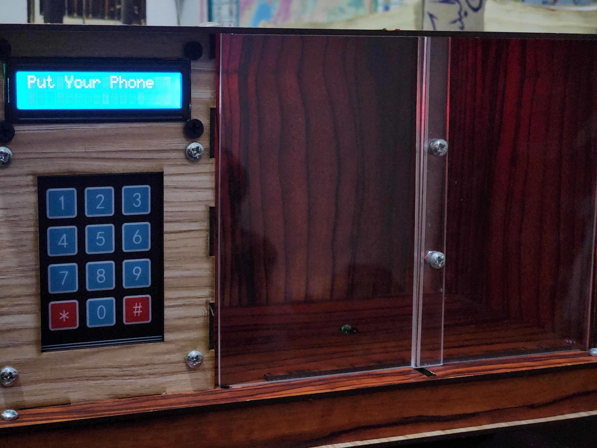
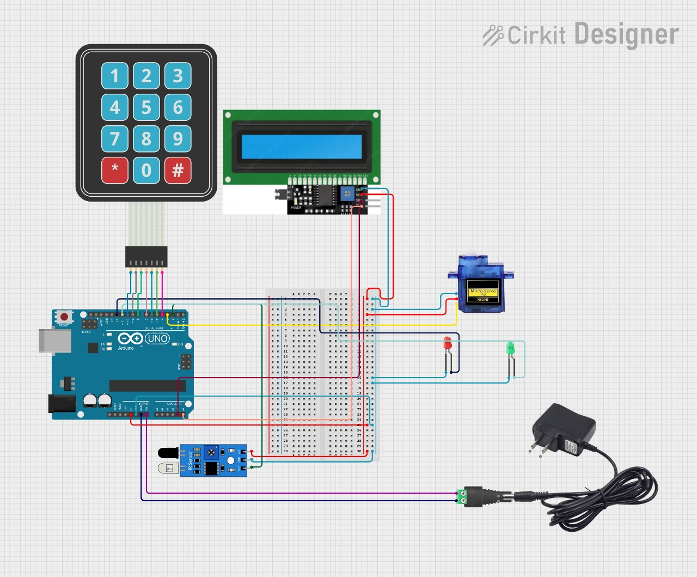

# Secure Door Lock System

This project implements a **Secure Door Lock System** using Arduino. It features a servo motor-controlled locking mechanism, an LCD interface for password input, and an infrared (IR) sensor to detect objects. The system uses a 4x3 keypad for password entry and incorporates LEDs to indicate system status.

---

## Features

- **Password Protection**: Users can set, confirm, and validate passwords for secure access.
- **Servo-Controlled Door Lock**: The servo motor locks and unlocks the door.
- **LCD Display**: Provides user feedback during password setup and entry.
- **IR Sensor**: Detects objects to trigger the lock mechanism.
- **LED Indicators**: Red LED indicates locked status; Green LED indicates unlocked status.

---

## Hardware Requirements

1. Arduino Uno (or compatible microcontroller)
2. Servo motor
3. 4x3 Keypad
4. LCD (16x2 with I2C module)
5. Infrared (IR) sensor
6. Red and Green LEDs
7. Resistors (220 ohm for LEDs)
8. Jumper wires
9. Breadboard or PCB

---

## Circuit Diagram

**Connections:**

- **Keypad**:
  - Rows: Pins 10, 9, 8, 7
  - Columns: Pins 6, 5, 4

- **LCD**:
  - Connect via I2C module (Address: 0x27)

- **IR Sensor**: Pin 2

- **Servo Motor**: Pin 3

- **LEDs**:
  - Red LED: Pin 12
  - Green LED: Pin 11

---

## Software Requirements

1. Arduino IDE
2. Libraries:
   - [Servo.h](https://www.arduino.cc/reference/en/libraries/servo/)
   - [LiquidCrystal_I2C](https://github.com/johnrickman/LiquidCrystal_I2C)

---

## Setup Instructions

1. Clone the repository:
   ```bash
   git clone https://github.com/devMohamedYusri/SmartLockBox.git
   ```
2. Open the `Secure-Door-Lock-System.ino` file in the Arduino IDE.
3. Install the required libraries:
   - Navigate to **Sketch > Include Library > Manage Libraries** and search for `Servo` and `LiquidCrystal_I2C`.
4. Connect the hardware as per the circuit diagram.
5. Upload the code to the Arduino board.

---

## How It Works

### Initialization
1. The system initializes with the message "Put Your Phone" displayed on the LCD.
2. The door is locked by default.

### Setting a Password
1. Trigger the system by placing an object near the IR sensor.
2. Set a password using the keypad (minimum 4 digits required).
3. Confirm the password to complete the setup.

### Unlocking the Door
1. Enter the password on the keypad.
2. If the password matches, the green LED lights up, and the servo unlocks the door.
3. If the password is incorrect, the red LED indicates a failed attempt.

### Additional Features
- The system resets the password setup process if mismatched during confirmation.
- The door automatically locks after a defined time.

---

## Demo





## Troubleshooting

1. **IR Sensor Not Detecting Objects:**
   - Check the connection to Pin 2.
   - Verify the IR sensor's functionality with a multimeter.

2. **LCD Not Displaying Text:**
   - Ensure the I2C address is correctly set to `0x27`.
   - Check the SDA and SCL connections.

3. **Servo Not Moving:**
   - Verify the servo's connection to Pin 3 and power supply.
   - Check if the servo is receiving commands using test code.

4. **Incorrect Password Behavior:**
   - Ensure the keypad is properly connected.
   - Verify row and column pin configurations in the code.

---

## License

This project is licensed under the [MIT License](LICENSE).

---


## My Team

This project was developed in collaboration with an amazing team:
- Saleh Khalifa
- Abdallah Khaled
- Abd Elrahman El-Kassas
- Ahmed Abd Elbadea


## Contact

For inquiries or feedback, please contact:
- **Name**: Mohamed Yusri
- **Email**: [mohamedyousry373.d@gmail.com](mailto:mohamedyousry373.d@gmail.com)
